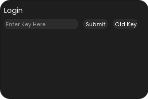
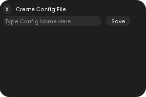

# <span style="color:#d42b43;">Valorant Artifical Intelligent Aimbot</span>

I've been working on this project for about a year, and I believe it's time to share it. Note: This guide does not cover how to spoof your Arduino Leonardo to bypass anti-cheat detection, but I am providing you with the complete aimbot code.

This project involved me training a custom model using YOLOv5 to create an external aimbot for Valorant (around 10k images). The setup uses an Arduino Leonardo, a USB Host Shield, and a USBTiny to flash the Arduino, allowing it to circumvent anti-cheat system.

## <span style="color:#f3c00c;">Features</span>
- **Aimbot**: Automatically locks onto enemies for precise targeting.
- **Aimbot Smoothing**: Adjust the speed of the aimbot for a more natural aiming motion.
- **SilentAim**: Shoots a bullet at the target without moving the crosshair.
- **Flickbot**: Instantly snap to target positions and fires one bullet, great for the guardian/sheriff/marshall.
- **Flickbot Smoothing**: Smooths out the flicking, making it look for natural.
- **Anti-Recoil**: Minimizes weapon recoil to maintain accuracy during firing.
- **Rage Mode**: Instant Lock on all both aimbot and flickbot.
- **Custom Crosshair Overlay**: External crosshair to make it less obvious that you're cheating.
- **Enemy Color Selection**: Choose specific colors for your enemy outline preference.
- **Custom Keybinds**: Adjust Aimbot/Flickbot Activation Keys.
- **Custom Sensitivity Adjustment**: Fine-tune aiming sensitivity to match your in game sensitivity.
- **Load/Save Config System**: Easily save and load your preferred settings for future use.
- **Randomized Application Name**: Instead of the app being namaed "Cheats" which could lead to bans, it will generate a random name like "XASJE4"
- **Login Screen For KeyAuth**: To allow only certain users to use the application.

## <span style="color:#f3c00c;">Screenshots / Showcase</span>

### Aimbot/FlickBot/SilentAim Showcase

[](https://www.youtube.com/watch?v=P-6v8fIq39A)

### Graphical User Interface
<div>
    <div>
    
    
    
    </div>
    <div>
    
    
    
    
    </div>
</div>

## <span style="color:#f3c00c;">Requirements</span>
*This code is optimized and programmed for NVIDIA GPUs using cuDNN and TensorRT for faster inference speeds and higher frame rates. However, it can be modified to run on a CPU if needed.*

- Windows 10/11
- CUDA Toolkit 11.6 Update 2
- cuDNN files
- TensorRT files
- Python 3.10.0
- Nvidia GPU
- Arduino Leonardo
- Arduino USB-Host Shield

## <span style="color:#f3c00c;">Installation</span>

*Side Node: If you're going to build this for yourself, you will have to edit the code to remove the login screen, I won't be showing how todo this, it's simple*

1. Clone the repository:
    ```bash
    git clone https://github.com/JeffVu-1/Valorant-A.I-Aimbot.git
    ```

2. Install Python version 3.10.0 and during installation make sure you select `Add Python 3.10.0 to PATH`

3. Go into the requirements folder and the run `install.bat`

4. Install CUDA 11.6.2 from the <a href="https://developer.nvidia.com/cuda-toolkit-archive" style="color:#3498db;">NVIDIA CUDA Toolkit Archive.</a>

5. Follow the <a href="https://docs.nvidia.com/deeplearning/cudnn/latest/installation/windows.html" style="color:#3498db;">NVIDIA cuDNN Installation Guide</a> to download and install cuDNN.

6. Refer to the <a href="https://docs.nvidia.com/deeplearning/tensorrt/install-guide/index.html#installing-zip" style="color:#3498db;">NVIDIA TensorRT Installation Guide</a> to download and install TensorRT.

<span style="font-style:italic;"><br>Step 7 is Optional (as I've already included my best.engine file)<br></span>

7. After installing CUDA, cuDNN, and TensorRT, navigate to the `library` folder in the project directory and run `convert-to-engine.bat`. (Note: If you're using an NVIDIA 4000 series GPU, skip this step, as CUDA 11.6.2 does not support this series)

8. In the `library` folder, open `Mouse.txt` and update the relevant fields with your spoofed Arduino information. You can obtain this information using <a href="https://the-sz.com/products/temple/" style="color:#3498db;">Temple - USB Device Info</a>.


8. Head to the root directory of the project and run `Start.bat` to use the cheat

## <span style="color:#f3c00c;">Acknowledgements</span>
<ul style='list-style:none; padding:0; margin:0;'>
<li><a href="https://github.com/ultralytics/yolov5" style="color:#3498db;">YOLOv5 GitHub Repository</a> - Used for training the AI model and implementing the aimbot.</li>
<li><a href="https://github.com/hoffstadt/DearPyGui" style="color:#3498db;">Dear PyGui GitHub Repository</a> - A Python GUI framework used for creating custom overlays and UI elements.</li>
<li><a href="https://pypi.org/project/QtPy/" style="color:#3498db;">QtPy5</a> - Using this framework to draw a custom overlay crosshair.</li>
<li><a href="https://github.com/keyauth" style="color:#3498db;">KeyAuth GitHub Repository</a> - Using this for the Auth system</li>
</ul>

### <span style="color:#f3c00c;">Disclaimer</span>
I am not responsible for any misuse or bans that may result from using this code. This project was created for educational purposes to explore AI technology.


### <span style="color:#f3c00c;">License</span>
This project is licensed under the MIT License
